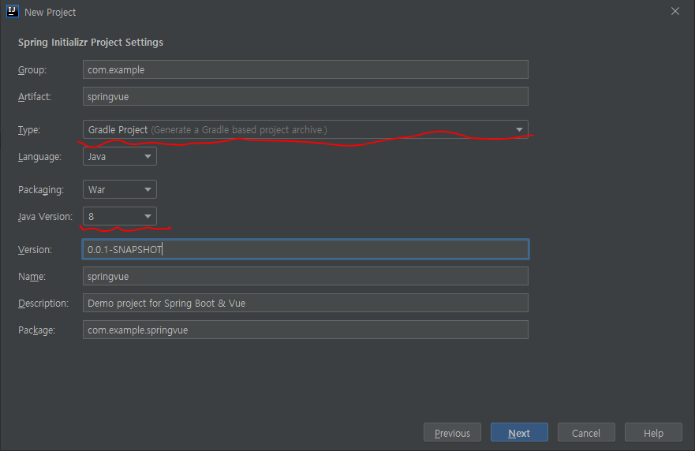

# Springboot + Vue 예제
Springboot와 Vue 를 이용한 간단한 Todo 웹을 만들어본다.

# 배울 수 있는 것
Springboot와 Vue를 이용한 SPA 웹앱 개발

# 사용 툴

## Backend
* Node 13.7.0
* Vue cli 4.5.3
* Vue 2.6.11
* Axios

## Frontend
* Springboot 2.3.2
* Springframework 5.2.8
* Spring Thymeleaf 2.3.2

# Node 설치
https://nodejs.org

# Vue CLI 설치
참고: https://cli.vuejs.org/guide/installation.html

```
npm install -g @vue/cli

or

yarn global add @vue/cli
```

-g 옵션을 빼고 설치하면 현재 경로의 node_modules 폴더에 설치된다.
node_modules/.bin 경로를 PATH에 추가하면 vue 명령을 사용할 수 있다.
```
export PATH=$PATH:./node_modules/.bin
```

설치 후 버전을 체크해보자
```
vue --version
@vue/cli 4.5.3
```


# IntelliJ 프로젝트 설정
IntelliJ 2020.1을 기준으로 설명합니다.

IntellJ 실행 후 신규 프로젝트를 생성합니다.


1단계


2번째
Type을 Gradle Project를 선택합니다.
Java Version은 8으로 맞춰줍니다. (8 이상이면 문제없음)
 

3단계


4단계
Finish 버튼을 눌러 완료합니다.

# Thymeleaf 의존성 추가 
build.gradle에 Thymeleaf 의존성을 추가해줍니다.
```
dependencies {
    implementation 'org.springframework.boot:spring-boot-starter-thymeleaf'
    ...
}
```

# 소스 정리
PROJECT_HOME/src/main 밑의 소스들을 git과 맞추고 불필요한 파일들은 지운다.

# frontend vue 초기화
PROJECT_HOME에서 vue frontend 구조를 생성한다.
```
vue create frontend
```

Windows gitbash에서 실행시 방향키로 설정을 확인할 수 없다.
이런 경우 winpty로 실행해야 한다.
```
$ winpty vue.cmd create --no-git --packageManager npm frontend 
```

```--packageManager```를 npm으로 설정하지 않으면 yarn으로 설정되는데 windows에서 아래 오류가 발생할 수 있다.
이런 경우 Web UI를 이용해서 생성해보자
```
Vue CLI v4.5.3
Failed to check for updates
✨  Creating project in D:\workspace\playground\springvue\frontend.
⚙️  Installing CLI plugins. This might take a while...

 ERROR  Error: spawn yarn ENOENT
Error: spawn yarn ENOENT
    at notFoundError (C:\Users\user\AppData\Roaming\npm\node_modules\@vue\cli\node_modules\cross-spawn\lib\enoent.js:6:26)
    at verifyENOENT (C:\Users\user\AppData\Roaming\npm\node_modules\@vue\cli\node_modules\cross-spawn\lib\enoent.js:40:16)
    at ChildProcess.cp.emit (C:\Users\user\AppData\Roaming\npm\node_modules\@vue\cli\node_modules\cross-spawn\lib\enoent.js:27:25)
    at Process.ChildProcess._handle.onexit (internal/child_process.js:275:12)

```

Web UI에서 프로젝트 생성하기
```
$ vue ui
```

패키지 매니저는 npm을 선택하자.
git은 메인 프로젝트에서 관리하므로 체크하지 말자.
참고로 Vue UI에서는 플러그인, 의존성 등 관리가 편리하다.

## Vue 실행해보기
```npm run serve``` 후 http://localhost:8080 에 접속해보자.
페이지가 정상적으로 보인다면 정상적으로 생성된 것이다.

## Vue 빌드를 spring 소스에 통합하기
Backend, Frontend 코드를 통합 관리하려면 Gradle과 Vue 설정을 변경해야 한다.
우선 frontend 폴더에 vue.config.js를 아래처럼 작성한다.
```
module.exports = {
    outputDir: "../src/main/resources/static",
    indexPath: "../static/index.html",
    devServer: {
        proxy: "http://localhost:9080"
    }
};
```

- outputDir: npm run build 기본 dist 폴더가 아닌 spring static 리소스에 빌드되도록 한다.
- indexPath: index.html 생성 경로
- devServer: Springboot WAS 접속 주소
    springboot가 9080, vue가 8080 포트를 사용한다면 proxy 설정을 통해서 8080으로 들오온 요청은 모두 9080으로 보내진다.


Backend의 Gradle 빌드시 npm 통합을 위해 'com.moowork.node' 플러그인을 추가하고 
필요한 타스크를 작성하자. 
참고: (./build.gradle)[build.gradle]


